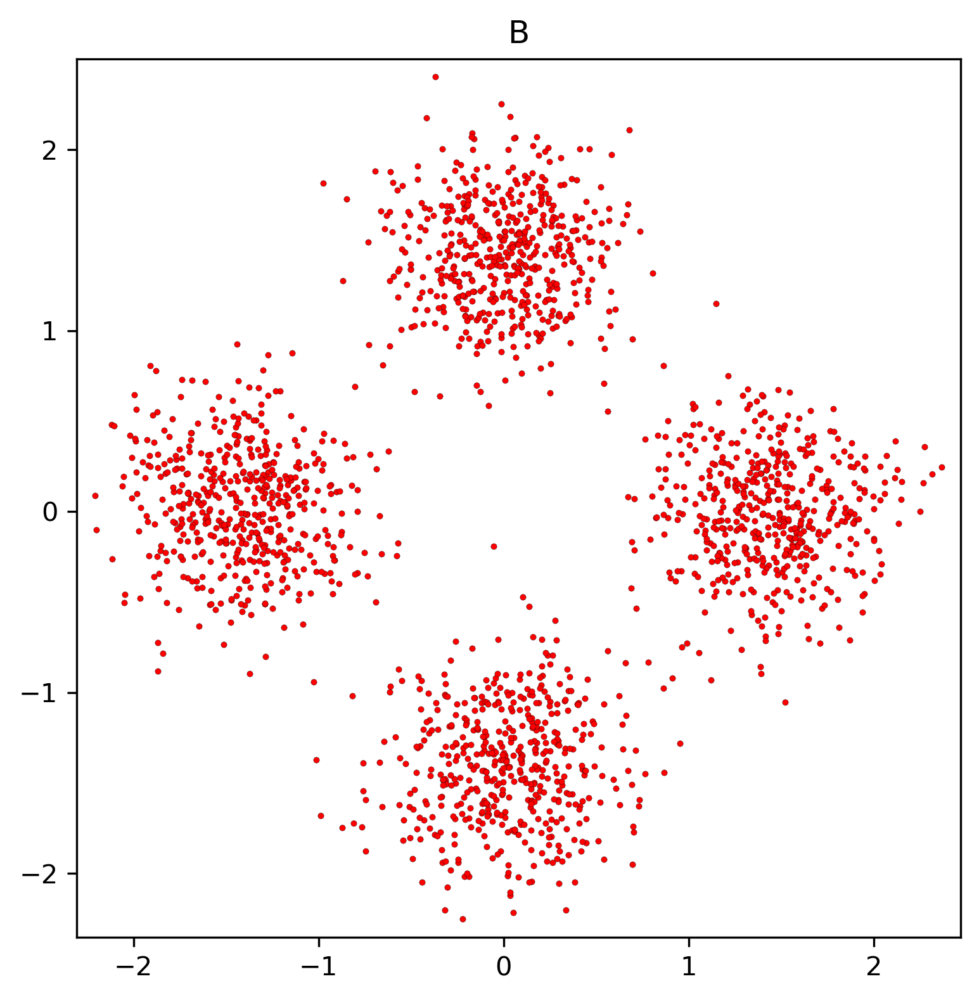
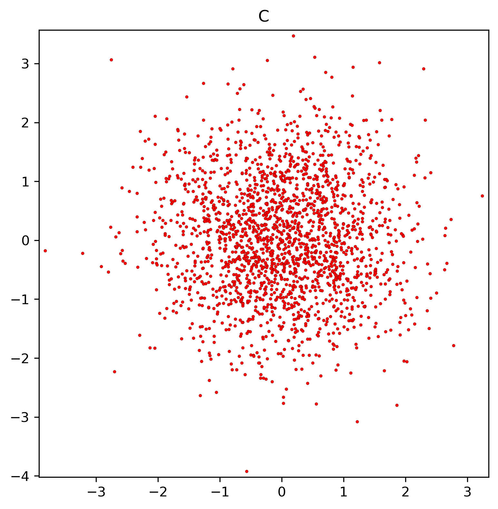

# Replace Frechet Inception Distance (FID) with Sinkhorn Inception Distance (SID)

This repo contains the code to reproduce this [post](https://wangxin0716.github.io/2019/10/25/FID-problems.html).

We show that FID fails on a toy example by unreasonably assume the feature extracted from Inception model are 
from Gaussian distributions. We also propose to replace it with Sinkhorn distance, which is an approximation
of wasserstein distance, or earth mover distance.  

Code for computation of sinkhorn distance is borrowed from [SihkhornAutoDiff](https://github.com/gpeyre/SinkhornAutoDiff).

Run the following command:

``
python fid.py
``

### Toy example

Distribution A:

Distribution B:

Distribution C:

FID fails discriminate among these distributions: FID(A, B) = FID(A, C) = FID(B, C) = 0.

However, SID could, SID(A, B) = 0.83, SID(A, C) = SID(B, C) = 0.56
